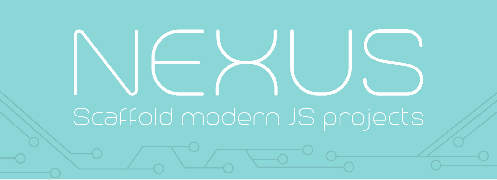

# generator-nexus 

_Scaffold modern JS projects_

---

## About

_Nexus_ is a [Yeoman](http://yeoman.io) generator for scaffolding modern JS projects. This includes everything from a simple vanilla JS npm package to a complex React web app. Although each project is different, a lot of tooling overlaps, so _Nexus_ has a consistent _Core_ which can be customized and extended by your choices to the generator prompts. Based on your choices, _Nexus_ lays down cutting-edge best practices and boilerplate setup in seconds so that you can focus on the unique parts of your project.

_Nexus_ has been built in a modular way so that as the industry moves to new technology choices, the generator options will be updated to match.

---

## Getting Started

1. `npm install -g generator-nexus`
1. `yo nexus` in an empty directory
1. Answer the prompts and wait for everything to be installed
1. `npm run dev`

---

## How it works

### Project Type

When you first run `yo nexus`, _Nexus_ asks you to pick your project type:

- npm package (vanilla JS)
- web app (React)

### General Info

_Nexus_ will ask for general info like your project name, project description, etc.

### Core

_Nexus_ prepares a _Core_ set of of files and folders which will be customized based on the rest of your choices:

- `src/`
  - Boilerplate code
- `dist/`
  - Public code, automatically built from `src/` directory code ^
- `.gitignore`
- `package.json`
- `README.md`
- `webpack.config.js` _(only added for React project types)_

### General Extensions

After you select your project type and complete the general info questions, _Nexus_ asks if you want to extend the _Core_ with some general tools:

##### Editor formatting (EditorConfig)

- Adds an `.editorconfig` file to the root of your project

##### Linting (ESLint)

- Adds npm scripts for linting, specific to the project type you selected
- Adds recommended eslint rules for all JS projects
- Adds linting dependencies and configuration to your `package.json`
- Adds React/JSX specific linting rules, if you selected a React project type

##### Testing (Mocha)

- Adds npm scripts for testing, specific to the project type you selected
- Adds an example test file for the default code generated, based on the project type you select
- Adds testing dependencies and configuration to your `package.json`

##### Continuous Integration (Travis CI)

- Adds a `.travis.yml` file to the root of your project
- Adds a Travis CI badge to the top of your `README.md` based on your answers to the generator prompts

### React Extensions _(coming soon)_

If you selected a React project type, _Nexus_ asks if you want to extend the _Core_ and _General Extensions_ with _React Extensions_:

##### Isomorphic rendering _(coming soon)_

- Sets up a Node server for rendering your app

##### Isomorphic routing _(coming soon)_

- Adds routing which can be used on both the server and client

##### Styling _(coming soon)_

- Adds some base style variables and theming using [React's inline styles](https://facebook.github.io/react/tips/inline-styles.html)

##### Continuous Deployment (Heroku) _(coming soon)_

_Required selections: Travis CI, Isomorphic Rendering_

- Updates `.travis.yml` file with Heroku information

---

## Roadmap

- [x] `v1.0.0` release
- [ ] React Extension: isomorphic rendering option (Node server)
- [ ] React Extension: isomorphic routing option (flatiron director)
- [ ] React Extension: styling option (React inline styles)
- [ ] React Extension: continuous deployment option (Heroku)
- [ ] After Node v4.0.0 is released, update `engine` in `package.json` to `4.0.0`, which will allow use of ES6 in `webpack.config.js`

---

## Contributing

Contributions are welcome!

1. Clone
1. `npm install`
1. `npm run dev`
1. Follow code style in project
1. Ensure test coverage for any changed functionality
1. Submit a pull request

---

## License

MIT
